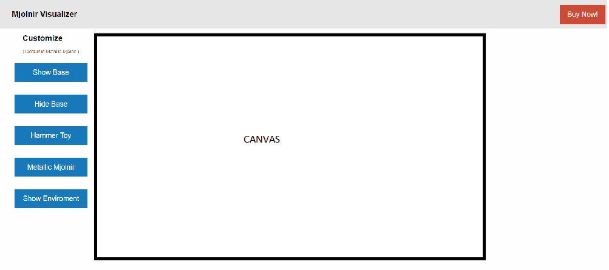
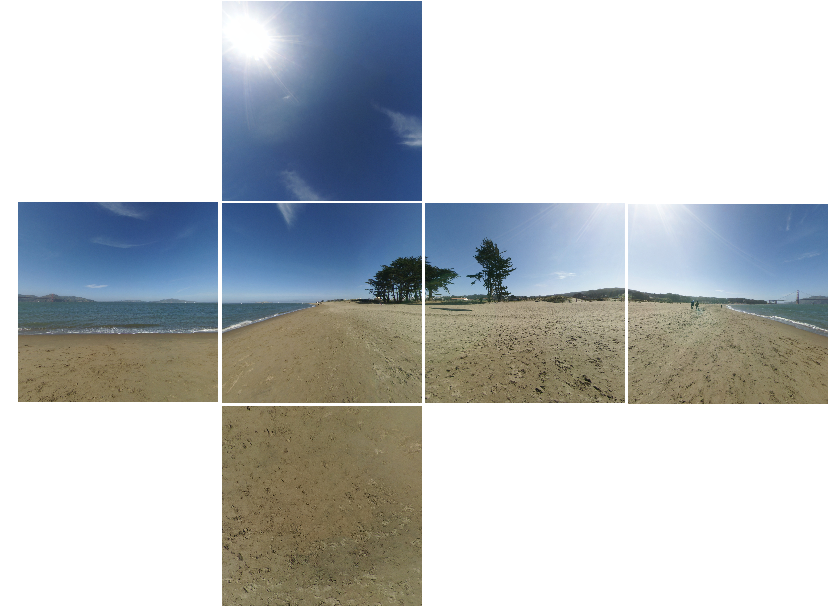

# ProductVisualization

READ CAREFULLY this document BEFORE you start!

## Prerequisites

- read carefully all slides and notes up to lecture 15 before you start. Try the proposed exercises. As you progress in the project, read also lectures up to 18 (post processing).

## Hints

- Try to work out a basic project which satisfies all requirements well before the deadline and as soon as possible: you will then use the remaining time to refine, improve and polish.
- If you are stuck for too much time on a problem, ask for help, preferably in the forum.
- the process is as important as the result. Use this project to learn a workflow, and how to use tools effectively. Experiment, and try to come up with efficient, elegant, and well commented code.
- commit often in your git repository and with meaningful comments.
- do not choose too complex products with many materials. 2-4 materials are enough.

## Goals

The well-known ACME company has asked you to build a product **Web visualizer / configurator** for its new e-commerce site. Before giving you the job, ACME wants to evaluate how faithfully you can visualize and configure products.  ACME sells everything, so you can choose whatever kind of product you want for the demonstration.

Your goal is to build a Web application (a HTML page) that:

- visualizes a product in 3D using three.js, using PBR equations and materials;
- allows the user to inspect the product (e.g. by orbiting the camera around it), and change some material on it by choosing from a few alternatives.

Try to make it look like a simple, but real portion of an e-commerce site, not a three.js example: choose carefully colors, fonts, images, and icons, also taking inspiration from real web sites.

## Steps (read CAREFULLY)

3. Prepare, and add to the repository, a journal.md file for logging your progress and choices.

1. Choose a product for which: (i) you can easily build a 3D model, or (ii) you can download a 3D model which you have the right to use in non-commercial applications. The model should not be too complex (not more than 50k vertices) and in some format that three.js can read. [Three.js examples](https://threejs.org/examples/) provide a list of loaders for different formats: beware that not all of them work perfectly, and you might have to try with different formats.

2. Design the lighting for the product. Products in web sites and catalogues are photographed using strategically placed lights that enhance details and shape. For example, [searching google images for product photography lighting](http://www.google.com/images?q=product+photography+lighting) will show you a number of real-world lighting setups that are used for products. In your lighting setup, you can use whatever you want, from punctual lights, to environment lighting, or light maps, or any combination of them.

3. Design the PBR materials for the product. You can use PRB textures found anywhere, or produce them, e.g. with Substance Designer or B2M. If you use textures authored by someone else, just make sure you have the rights for using them in our context (non-commercial application). At least one of the materials must have 2-3 alternatives (e.g. different colors, or materials).

4. Build the application that renders the chosen 3D model, with the designed lighting setup and materials, and an user interface for selecting the material between the alternatives. **Important: you can implement this step in two different ways**:

    a. using three.js built-in lights and materials (MeshStandardMaterial or MeshPhysicalMaterial), without writing any shader. In this case, your final report **must include** the equations of the BRDF and rendering equations that you are using. In other words, you have to dig into three.js shaders to find which equations are used, and write them (in mathematical form, not using code);

    b. using shaders written by you, e.g. by extending the shaders we saw in the classroom. In this case, your report needs just to mention the kind of BRDF / lights you have implemented (no need to report the equations, unless you are using different BRDF or adding some new equation).

4. If possible, try to take into account implicit requirements as well. For example, you cannot use textures with file sizes of dozens of megabytes for a Web site; and also, your page should render at least at 30 fps on average smartphones. You will get bonus points for a result that could be deployed to a Web site with few or no modifications.

5. Write a concise report by overwriting this file.

## Starting code

There is no specific starting code for this project. If you choose to use your own shaders, choose from our examples the one that uses the lighting techniques you want to use, or combine from more examples for a specific set of techniques. If you want to use
three.js provided materials and lights, you can start from some three.js built-in example.

## Documenting and report

For project documentation and reporting, we use the [markdown format](https://daringfireball.net/projects/markdown/syntax), which is also the format of this document. Markdown is a lightweight markup language with plain text formatting syntax which is easy and quick to write, very human-readable, and that can be converted to HTML.

If you need more features than the ones that markdown provides (e.g. writing equations), you can use one of its extensions called [markdeep](https://casual-effects.com/markdeep/).

You are required to document your project in two ways:

- maintain a journal (in a file called journal.md) describing key design decisions, changes, bug symptoms and solutions, including screenshots.
- create a report (by overwriting this file).

The report should be as brief as possible while covering the following points:

- overall description: what your project is about and the files it uses.
- results, including images of the scenes created, taken in a way that clearly illustrates that they satisfy the specification.
- brief explanation of the process that you used to make your scene. Include tools, assets, and planning steps.

## Constraints

If you use textures / 3D models / substances / ..., make sure that you have the rights to include them. For example, search for images that come with a [CC Attribution, ShareAlike or NonCommercial licences](https://creativecommons.org/share-your-work/licensing-types-examples/).

In this project, you are allowed to re-use assets taken elsewhere, but **entirely copying** others' work, even with slight modifications, is forbidden and will have serious consequences beyond the deletion of your project. In any case, mention any source of inspiration in your journal and final report.

## Follow-up

You are welcome to extend your project after the deadline, in any way your think is interesting. For example, you could add javascript libraries that analyze music and derive values in real-time that can be fed to three.js for animation purposes, or you could extend your terrain generation software such that hidden cube faces are not created in three.js. If you do that before the final exam, you might get bonus points for this kind of activies - just let me know any progress you make.

## Credits

The image above comes from a [Ford car configurator built in three.js](http://www.ford.com/cars/mustang/customizer/#!/customize).

# Introduzione

Per il seguente progetto si è cercato di perseguire l'idea di sviluppare una sezione di un sito che consente di visualizzare in 3D un prodotto da acquistare in modo da sviluppare correttamente non solamente la parte dedicata al rendering 3d, ma in generale tutta la struttura della pagina. Per fare ciò ci si è avvalsi del Framework Front-End [Fundation](http://foundation.zurb.com/), che consente di sviluppare in modo facile e Standardizzato strutture HTML, CSS e Javascript.

In figura si può vedere la struttura creata: attraverso l'uso del layout a 12 colonne che è standard assodato del web, si è creata una barra superiore contenente il nome del sito, lo spazio per eventuali link appartenenti al menù di navigazione da inserire al momento di necessità ed infine un pulsante che si distingue grazie al colore dagli altri che consente di avviare la procedura d'acquisto del prodotto.

Infine, il resto della pagina è organizzato su due colonne distinte, la prima che occupa 2/12 dello spazio a disposizione prevede il menù che consentirà all'utente di interagire con la scena 3d, la seconda invece contiene la scena stessa. Sono state apportate poi delle brevi modifiche estetiche per far risaltare il tutto. Tali modifiche sono visibili in **css/app.css**. Va detto che nonostante l'uso di questo Framework di sviluppo il canvas è risultato non rispettare i vincoli su di esso imposti. Pertanto è stato traslato un poco a seconda delle dimensioni dello schermo l'elemento renderer dell'applicazione costruita per evitare eventuali sovrapposizioni. 

## Il Modello Usato

Il modello usato per questa applicazione è stato ottenuto dal sito web [Free3D](https://free3d.com) ed il file usato è il [Thor Hammer](https://free3d.com/3d-model/thor-hammer--62945.html) che è disponibile con licenza **Non-commercial use License**. Il modello è stato scaricato nella sua versione **.obj** e non sono state applicate le sue texture predefinite, in quanto si è preferito adottarne delle versioni ad hoc creando dei materiali personalizzati. Nello specifico si è cercato di creare:
- Una base a cui viene applicata una texture su cui far poggiare il martello. Tale base può venire mostrata o nascosta dall'utente a seconda delle sue preferenze.
- Una versione prettamente metallica del martello.
- Una versione giocattolo composta da materiali gommosi.
- Una versione che subisce un effetto di rifrazione dalla luce ricevuta, da vendere nel contesto come versione "invisibile" o "mimetica".

Ciascuna delle versioni sopra elencate è stata sviluppata estendendo e modificando gli shader visti a lezione.

## Luci

Le luci previste per questa applicazione sono diverse, come si sarà capito al punto precedente, a seconda del contesto d'uso. Il martello verrà illuminato da 4 luci puntuali nelle sue versioni giocattolo e metallico, poste una di fronte ad esso, due ai lati ed infine una verrà posta sopra. L'idea è di consentire una illuminazione artificiale e completa dell'oggetto, mantenendo comunque alcune zone in ombra, ma esaltando alcuni particolari degni di nota, come i glifi posizionati sulla sua testa o le sue irregolarità. 

Infine la versione che prevede la rifrazione della luce sfrutterà ovviamente una CubeMap (visibile in figura) per generare luce attraverso una Enviroment Map. Le immagini usate per generarla sono disponibili attraverso licenza **Creative Commons Attribution 3.0** e quindi è utilizzabile per questo progetto gratuitamente. 

## Materiali

## Struttura del codice

## Eventuali Sviluppi

- Rotazione camera diversa con base e senza

- Ambient light per versioni giocattolo e metallico