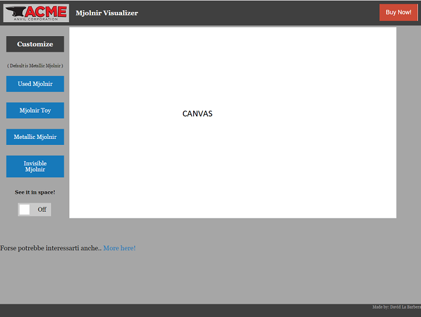

# Introduzione

Per il seguente progetto si è cercato di perseguire l'idea di sviluppare una sezione di un sito che consente di visualizzare in 3D un prodotto da acquistare in modo da sviluppare correttamente non solamente la parte dedicata al rendering 3d, ma in generale tutta la struttura della pagina. Per fare ciò ci si è avvalsi del Framework Front-End [Fundation](http://foundation.zurb.com/), che consente di sviluppare in modo facile e Standardizzato strutture HTML, CSS e Javascript.

In figura si può vedere la struttura creata: attraverso l'uso del layout a 12 colonne che è standard assodato del web, si è creata una barra superiore contenente il nome del sito, lo spazio per eventuali link appartenenti al menù di navigazione da inserire al momento di necessità ed infine un pulsante che si distingue grazie al colore dagli altri che consente di avviare la procedura d'acquisto del prodotto.

Infine, il resto della pagina è organizzato su due colonne distinte, la prima che occupa 2/12 dello spazio a disposizione prevede il menù che consentirà all'utente di interagire con la scena 3d, la seconda invece contiene la scena stessa. Sono state apportate poi delle brevi modifiche estetiche per far risaltare il tutto. Tali modifiche sono visibili in **css/app.css**. Va detto che nonostante l'uso di questo Framework di sviluppo il canvas è risultato non rispettare i vincoli su di esso imposti. Pertanto è stato traslato un poco a seconda delle dimensioni dello schermo l'elemento renderer dell'applicazione costruita per evitare eventuali sovrapposizioni. 

## Il Modello Usato

Il modello usato per questa applicazione è stato ottenuto dal sito web [Free3D](https://free3d.com) ed il file usato è il [Thor Hammer](https://free3d.com/3d-model/thor-hammer--62945.html) che è disponibile con licenza **Non-commercial use License**. Il modello è stato scaricato nella sua versione **.obj** e non sono state applicate le sue texture predefinite, in quanto si è preferito adottarne delle versioni ad hoc creando dei materiali personalizzati. Nello specifico si è cercato di creare:
- Una base a cui viene applicata una texture su cui far poggiare il martello. Tale base può venire mostrata o nascosta dall'utente a seconda delle sue preferenze.
- Una versione prettamente metallica del martello.
- Una versione giocattolo composta da materiali gommosi.
- Una versione che subisce un effetto di rifrazione dalla luce ricevuta, da vendere nel contesto come versione "invisibile" o "mimetica".

Ciascuna delle versioni sopra elencate è stata sviluppata estendendo e modificando gli shader visti a lezione.

## Luci

Le luci previste per questa applicazione sono diverse, come si sarà capito al punto precedente, a seconda del contesto d'uso. Il martello verrà illuminato da 4 luci puntuali nelle sue versioni giocattolo e metallico, poste una di fronte ad esso, due ai lati ed infine una verrà posta sopra. L'idea è di consentire una illuminazione artificiale e completa dell'oggetto, mantenendo comunque alcune zone in ombra, ma esaltando alcuni particolari degni di nota, come i glifi posizionati sulla sua testa o le sue irregolarità. 

Infine la versione che prevede la rifrazione della luce sfrutterà ovviamente una CubeMap (visibile in figura) per generare luce attraverso una Enviroment Map. Le immagini usate per generarla sono disponibili attraverso licenza **Creative Commons Attribution 3.0** e quindi è utilizzabile per questo progetto gratuitamente. 

## Materiali
I materiali metallici sono stati creati attraverso l'uso di uno Shader nella sua versione Microfacet, poichè tale versione consentiva risultati visivamente perfetti e con colori più vivi rispetto all'uso di un combined shader (cdiff + cspec). I colori vivi rendono bene l'idea di un martello appartenente ad una divinità e quindi senza alcun segno di usura data dal tempo e dall'utilizzo. Si è deciso in questo caso di usare due materiali distinti, uno dorato usato per gli intarsi del manico e le decorazioni della testa ed infine uno argentato che verrà applicato alla testa stessa ed al manico, componendo la struttura di base del martello. Le 4 luci puntuali integrate negli shader consentono, con questo tipo di materiale, un risultato visivamente pieno, in quanto 3 facce su 4 sono illuminate, consentendo di vedere il riflesso delle luci quasi da ogni angolazione e mantenendo in ombra alcuni elementi.

I materiali plastici invece sono stati creati ovviamente attraverso un combined shader integrando le informazioni inerenti a cdiff e cspec. Anche tali shader sono stati adottati nella versione vista a lezione ed integrati con le luci aggiuntive previste. I materiali usati in questo caso sono 3, tutti plastici e a far la differenza sono solamente i colori: rosso per la testa del martello, blu per il manico ed i glifi presenti sulla testa ed infine un materiale marrone per gli intarsi del manico. 

Infine la versione degli shader che implementa il fenomeno di rifrazione è stata creata partendo dallo shader visto a lezione che consente il reflection mapping e modificando il codice adeguatamente usando la funzione refract. Il rapporto dell'indice di rifrazione (1.0/2.0) è stato scelto dopo alcuni test poichè consentiva un risultato visivamente appagante. 

Per quanto riguarda infine la base d'appoggio, essa è stata creata usando un cilindro con una altezza estremamente ridotta ed applicandovi una texture tramite shader. Tale texture è il prodotto delle informazioni di una Specular Map, una Diffuse Map ed una Roughness Map che, combinate, garantiscono un risultato visivamente soddisfacente. Tali texture sono state ottenute gratuitamente dal sito web [GameTextures] (https://www.gametextures.com/free-materials/) e poi create ed esportate singolarmente attraverso il software Substance Player. Quelle usate sono visibili in figura. 

## Struttura del codice

Avendo previsto 3 scene totalmente diverse ed usato degli elementi di UI esterni, si è rivelato necessario utilizzare dei pattern di programmazione particolari. Al click di un pulsante che attiva la visualizzazione di un particolare elemento della scena viene avviato un metodo che setta a true una apposita variabile Booleana. Questa modifica verrà vista grazie ad un if durante il successivo ciclo di render, consentendo di chiamare il rispettivo metodo che costruisce l'oggetto con  i materiali desiderati ed infine ri-settando tale variabile a false per evitare la costruzione ciclica dell'oggetto ad ogni frame. Per favorire inoltre la migrazione della scena da un oggetto con dei materiali alla visualizzazione di un altro, è stata prevista la variabile selected_object alla quale, in ciascuna funzione di creazione degli oggetti sviluppata, viene passato l'oggetto costruito. Questo consente di verificare, prima di costruire un ulteriore oggetto se nella scena ne sono già presenti altri. Se si, l'oggetto attuale viene eliminato così da consentire la creazione di quello nuovo evitando sovrapposizioni indesiderate. Infine la variabile is_refract serve ad evitare che l'utente visualizzi la base d'appoggio all'interno dell'enviroment map e quindi ottenendo un risultato poco consono. Questo tipo di transizione farà tornare l'utente ad una situazione in cui viene visualizzata la base e l'oggetto viene istanziato come da default. inoltre, dato che per la rifrazione il background della scena diventerà la cubemap, in ogni metodo di creazione come prima cosa il background verrà ripristinato con il suo colore di default. In sintesi, il codice è così strutturato:
- All'interno dello script ma non all'interno di una funzione vengono definite le informazioni in merito alla scena, alle variabili necessarie, alla camera, ai materiali metallici, alle luci da usare e alla texture della base;
- La funzione **SetupOrbitControls()** contiene le istruzioni che consentono di vincolare la navigazione della scena da parte dell'utente, evitando attraversamenti di mesh, rotazioni eccessive oppure allontanamenti dall'oggetto infiniti;
- La funzione **Update()** consente di richiamare il corretto metodo per costruire l'oggetto con i materiali desiderati a seconda del click effettuato;
- La funzione **showBase()** e la **hideBase()** consentono di visualizzare e nascondere la base con la texture applicata. La variabile mesh_base viene impostata a null dopo la rimozione e verificata prima dell'inserimento per evitare duplicati;
- **OnWindowResize()** trasla la posizione del canvas in modo che non venga sovrapposto al menù laterale poichè, come detto prima il canvas stesso è risultato non rispettare le regole strutturali imposte da Foundation;
- Le funzioni **click_show_base(), click_hide(), click_show_toy(), click_show_metallic() e click_show_enviroment()** hanno il solo scopo di ascoltare il click del pulsante e settare a true la variabile corrispondente;
- La funzione **Metallic_Hammer** crea il martello con i materiali metallici. I figli del file obj vengono scanditi uno alla volta in modo che ciascuno abbia il materiale desiderato;
- **SetupToyHammer** contiene la definizione delle variabili uniform per i suoi materiali e la creazione del martello apposito seguendo la stessa modalità del precedente;
- Infine la funzione **ShowEnviroment** setta come background la cube map, calcola le uniforms apposite e crea un mjolnir il cui unico materiale rispetta la proprietà desiderata. 

## Eventuali Sviluppi

- Rotazione camera diversa con base e senza

- Ambient light per versioni giocattolo e metallico